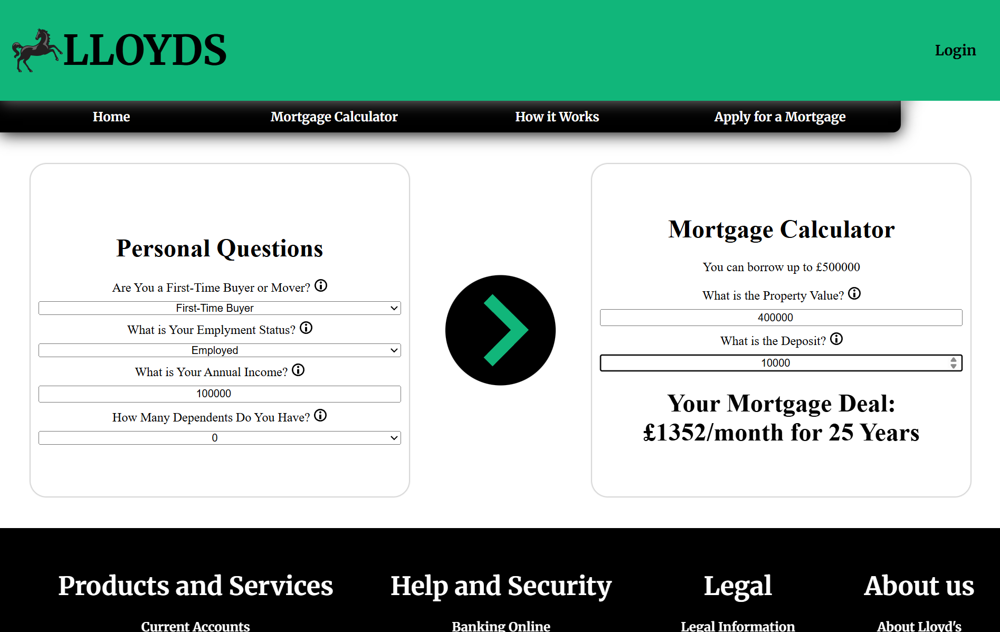

Name: Forage Job Simulation (Mortgage Calculator)
Author: Muhammad Abdullah
Technologies Used:
    - React
    - TypeScript
    - HTML/CSS
    - Git

Description:
This project was part of a Technology and Engineering Job Simulation Course for Lloyd's Banking Group, where I was tasked with redesigning the User Interface of their Mortgage Calculator page.

The project greatly strengthened my technical ability in TypeScript and HTML/CSS, discovering new ways to build dynamic, responsive and engaging web pages, using tools such as media queries and keyframes.

This was also my first ever experience in using the React Library, resulting in a new found base of knowledge on Components, useStates and useEffects.

Finally, this project is a symbol of the progression I have made with the Git System. I now possess a strong understanding of Git concepts such as the difference between fetch and pull, git flags and general commands.

Disclaimer
This project is for educational purposes only and is not affiliated with or endorsed by Lloyds Banking Group.
Branding elements (such as logos and colors) were used solely to replicate a realistic environment.

## 📸 Screenshot

